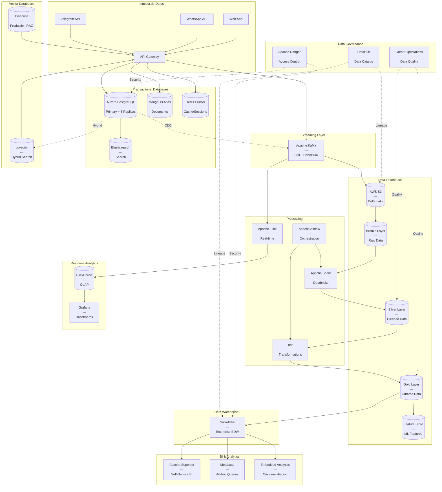
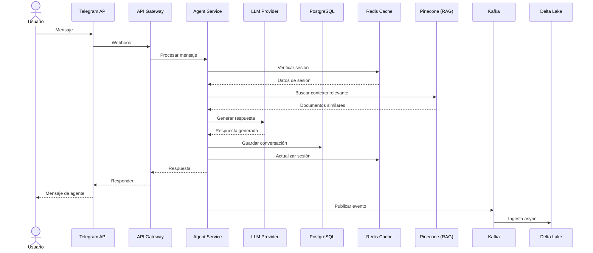
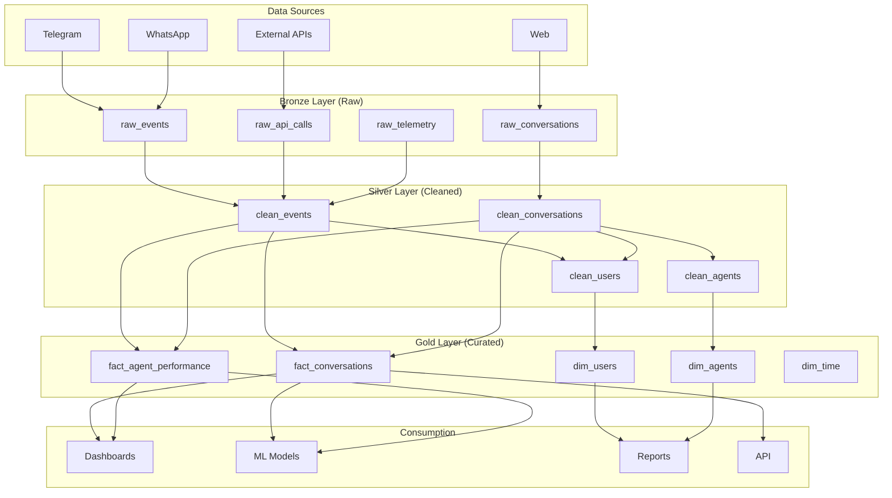
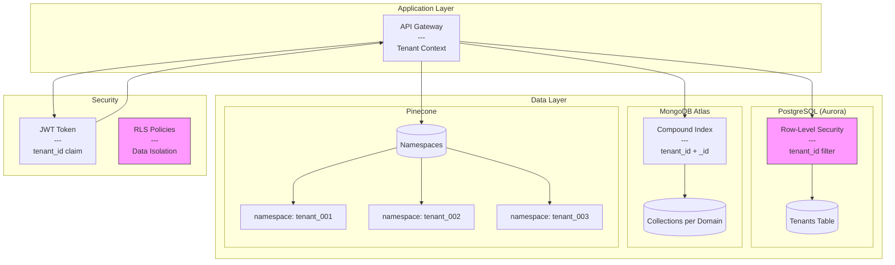
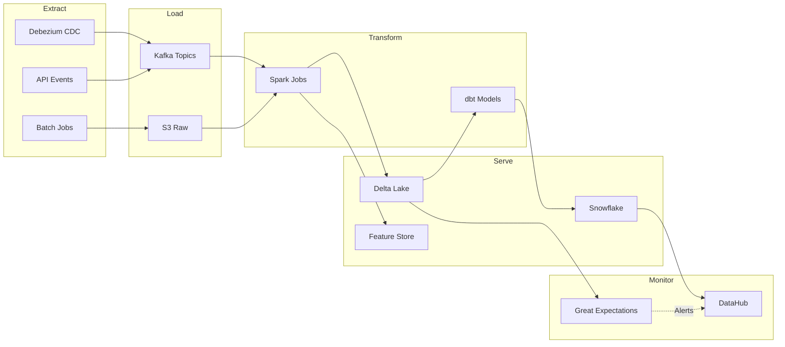

# Diagrama de Arquitectura de Datos - ControlIA
## Formato Mermaid para visualización



---

## Diagrama de Flujo de Datos - Conversación



---

## Arquitectura de Capas (Medallion)



---

## Arquitectura Multi-Tenant



---

## Pipeline de Datos



---

## Escalabilidad por Fases

```mermaid
timeline
    title Roadmap de Escalabilidad
    
    section Fase 1 : MVP
        0-100 tenants : PostgreSQL RDS
                      : S3 + Athena
                      : Redis Single
                      : MongoDB M10
                      : $2K/mes
    
    section Fase 2 : Growth
        100-1K tenants : Aurora PostgreSQL
                       : Delta Lake + Databricks
                       : Redis Cluster
                       : MongoDB M30
                       : Snowflake XS
                       : $8K/mes
    
    section Fase 3 : Scale
        1K-10K tenants : Aurora Sharded
                       : Kafka + Flink
                       : Redis 12 shards
                       : MongoDB M60
                       : ClickHouse
                       : $35K/mes
    
    section Fase 4 : Enterprise
        10K+ tenants : Multi-region
                     : Multi-cloud
                     : Auto-scaling
                     : $150K+/mes
```
